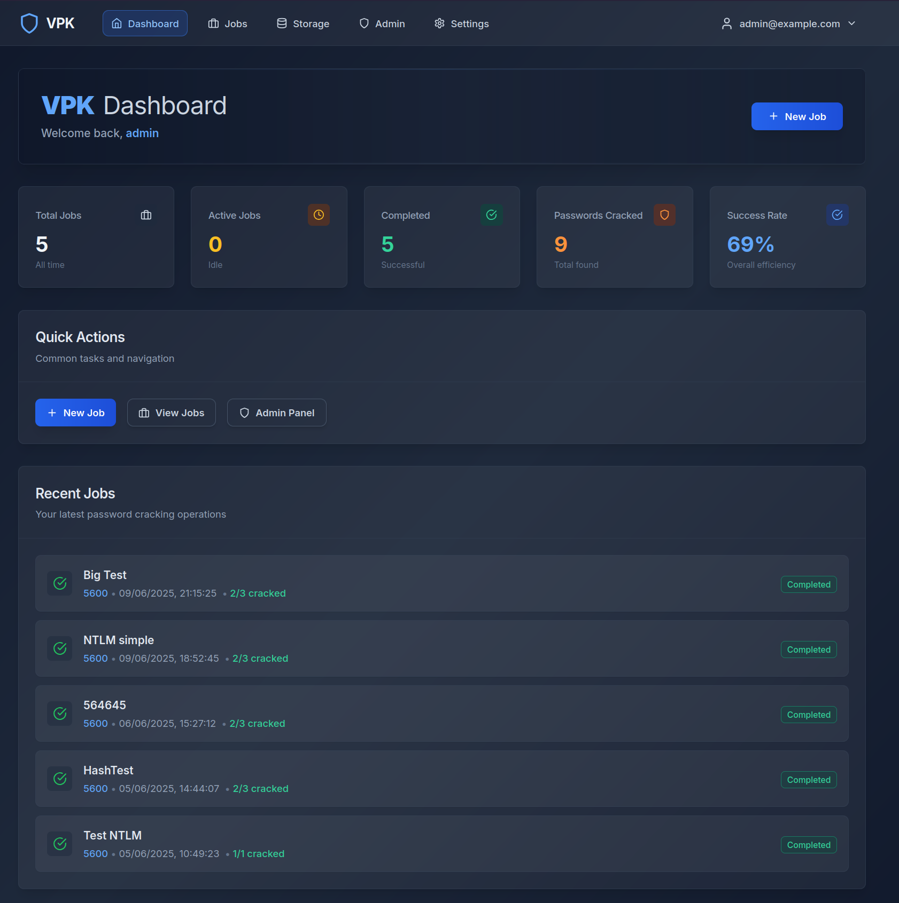
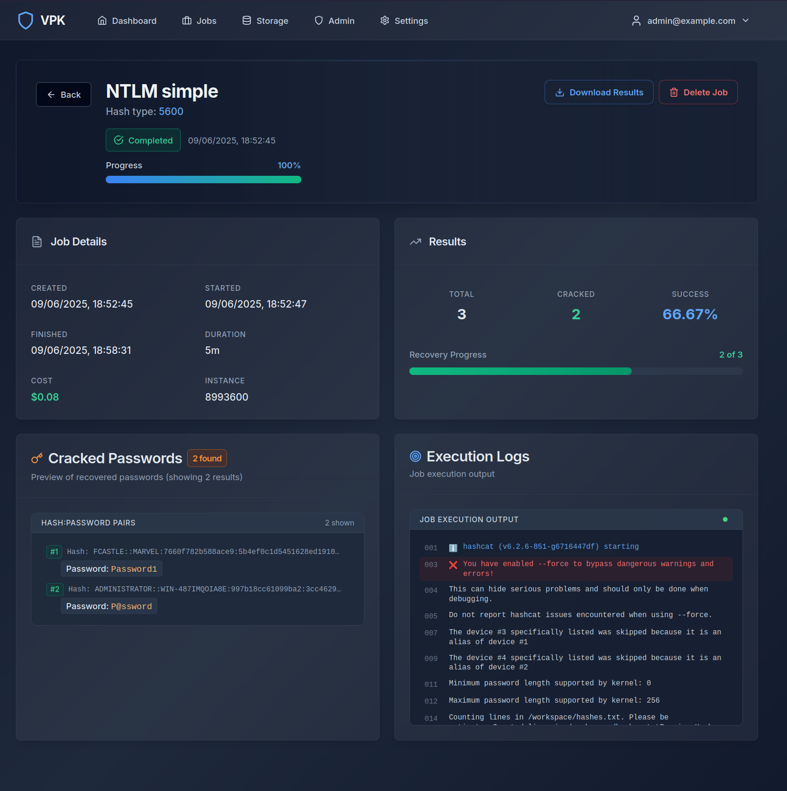

# VPK - Vast Password Kracker

A modern web-based platform that leverages Vast.ai GPU instances for authorised password cracking using Hashcat. Designed for red team operations and penetration testing. Built as an experiment that worked well, really wanted to play around with some LLM workflow integrations into front end design and quick prototyping, taking some shoddy CLI based approaches and making them better, sharing to hopefully improve it and to make our lives easier.




## Overview

VPK is a web-based control portal to orchestrate Vast.ai cracking instances. It's literally NPK but without the spot instancing - all hosts are rented for the duration you want them, no one steals them off you. Why? AWS spot instances are hard to come by these days. Vast provides a huge array of systems with massive GPU specs, perfect for password cracking.

However, there are some concerns with this approach, as trust in the provider's instances is not high. To try and get around that, the deployment implements the following security measures:

- Using only "approved resources"
- Using only EU/US locations
- Using only datacentre resources
- Using /dev/shm tmpfs stores for sensitive things (potfiles, uploaded hashes)
- Carrying out shred and overwrite actions on artefacts after completion
- Trying to keep everything in memory/clean as possible

This hopefully limits some of the potential security concerns around using Vast for these actions. But it's up to you as an individual and organisation to do your own due diligence.

## Important Notices

- This portal is in no way guaranteed to be secure. **DO NOT EXPOSE THE PORTAL PUBLICLY**. Use IP whitelisting/firewalls, Tailscale, whatever. Don't leave your stuff on the internet.
- Vast uses a large number of different locations and providers. I have done my best to come up with a solution that limits exposure as much as possible. Searches all require datacentre resources and "trusted cloud" resources. But using this is up to you - carry out your own risk assessment.
- Only supports AWS S3 buckets for lists and rules. Not planning on adding support for other buckets, but feel free to contribute if you need it.

## Features

- **Cloud-Native**: Leverages Vast.ai GPU marketplace for cost-effective, scalable computing
- **Secure Design**: Hash files stored in memory (tmpfs), no persistent disk storage on remote instances
- **Multi-Hash Support**: 60+ hash types including NTLM, Kerberos, WPA/WPA2, and more
- **Intelligent Management**: Automatic instance lifecycle, SSH key management, and resource optimisation
- **Real-time Monitoring**: Live progress tracking, execution logs, and performance metrics
- **Role-based Access**: Admin and user roles with proper permission controls
- **Cost Management**: Built-in spending limits and cost estimation
- **Auto Job Termination**: Jobs are cleaned and instances destroyed on completion or when hard time limits are met
- **Wordlist Catalogue**: Well-known lists from Weakpass mapped with statistics for accurate estimates
- **Multi-Format Support**: Supports 7z, ZIP, GZIP, BZIP2, and other compressed formats along with .txt wordlists
- **Multi Attack Support**: Supports Hybrid, Mask and multi rule based attacks.

## Architecture

### Core Components
- **Frontend**: Next.js 14 with TypeScript and Tailwind CSS
- **Backend**: FastAPI with async Python
- **Database**: PostgreSQL with Alembic migrations
- **Queue**: Redis + Celery for background job processing
- **Proxy**: Nginx with SSL termination and security headers
- **Storage**: AWS S3 for wordlists and rules

### Security Features
- **Memory-only Hash Storage**: tmpfs mounts prevent disk persistence
- **Memory-only Pot Storage**: tmpfs mounts used for potentially sensitive outputs like POT files and logs
- **Secure Cleanup Function**: Script deployed to shred files from tmpfs and clean histories and logs prior to instance destruction
- **SSH/SCP Streaming**: Direct data transfers utilising SSH and SCP over the built-in Vast APIs
- **Encrypted Settings**: Application secrets encrypted at rest
- **Rate Limiting**: Nginx-based protection against abuse

## Quick Start

For detailed deployment instructions, see [DEPLOYMENT.md](DEPLOYMENT.md).

### Development Setup
```bash
git clone https://github.com/d-sec-net/VPK
cd VPK
cp env-example .env
# Edit .env with your credentials
docker compose up -d
docker compose exec backend alembic upgrade head
```

Access the application:
- Frontend: http://localhost:3000
- Backend API: http://localhost:8000
- API Documentation: http://localhost:8000/docs

### Production Deployment
```bash
python setup.py  # Run automated setup wizard
./deploy.sh      # Deploy application
```

## Usage

For a full user guide check : [UserGuide.md](./docs/UserGuide.md)

### First-Time Setup

1. **Login with builtin Admin User**: Login with the configured default admin user (admin@example.com:admin123). Create a new Admin Account and disable the original.
2. **Configure Settings**: Go to Settings → Application Settings and configure:
   - Cost limits (max per hour, total cost)
   - File size limits and data retention policies
   - AWS S3 credentials and Vast.ai API key
3. **Upload Resources**: Use Storage Management to upload wordlists and rule files
4. **Test**: Create a test job to verify full functionality

### Creating Jobs

1. **Job Details**: Name your job and select hash type
2. **Files & Attack**: Upload hash file, select wordlist and rules
3. **Instance Selection**: Choose GPU instance based on performance/cost
4. **Time & Cost**: Set runtime limits and review estimated costs
5. **Review & Submit**: Confirm configuration and launch

### Monitoring Jobs

- **Real-time Progress**: Watch live progress bars and status updates
- **Execution Logs**: View detailed Hashcat output with colour-coded logs
- **Results**: Preview cracked passwords with hash:password format
- **Downloads**: Export full results as text files

## Security Considerations

- **Hash File Security**: Files stored in tmpfs (RAM) only, never on persistent disk
- **SSH Key Management**: Unique keys per instance, automatic cleanup
- **Encrypted Settings**: Application secrets encrypted with Fernet
- **Network Security**: Nginx security headers, rate limiting
- **Access Control**: Role-based permissions, session management

## Key Technologies

**Backend:**
- FastAPI with async/await
- SQLAlchemy ORM with Alembic
- Celery for background tasks
- Pydantic for data validation
- SSH/Paramiko for remote execution

**Frontend:**
- Next.js 14 with App Router
- TypeScript for type safety
- Tailwind CSS for styling
- React Context for state management

## Getting Help

1. Check application logs and review [DEPLOYMENT.md](DEPLOYMENT.md)
2. Create GitHub issue with logs and configuration details

## Roadmap

- Add job support for differing unsupported types such as PKS cracking
- Enforce data retention policies properly
- ~~Continue testing with complex custom attacks~~
- ~~Add support for multiple rules~~

## Licence

This project is for authorised security testing and research only. Users are responsible for ensuring compliance with applicable laws and regulations. Use responsibly and ethically.

## Contributing

1. Fork the repository
2. Create feature branch (`git checkout -b feature/amazing-feature`)
3. Commit changes (`git commit -m 'Add amazing feature'`)
4. Push to branch (`git push origin feature/amazing-feature`)
5. Open Pull Request

## Acknowledgements

- Hashcat team
- Vast.ai for democratising GPU computing access
- The NPK project, for being the entire inspiration for this
- [Bulletproof](https://redteam.bulletproof.co.uk) for giving me the time to develop this
