# User Guide

## First Time Login

### Default User

Once the application is deployed login with the default user admin@example.com : admin123. This initial user combo can be configured via your environmental variables.

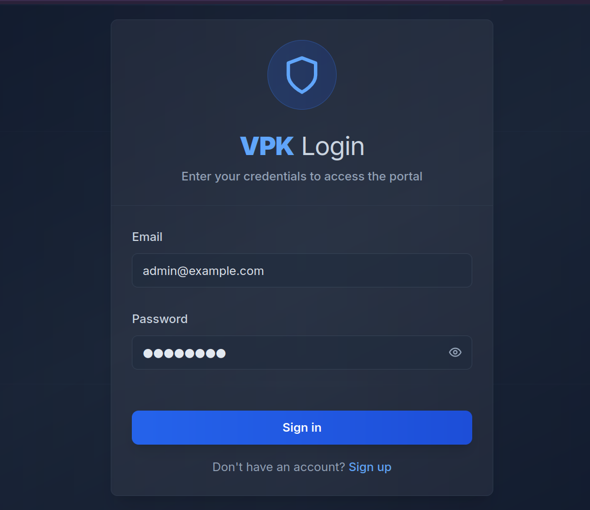

Once logged in. It is important that you create a new admin user and disable the default admin user. The default user will be recreated at startup so deleting it is not recommended.

To create a new user navigate to "Admin"

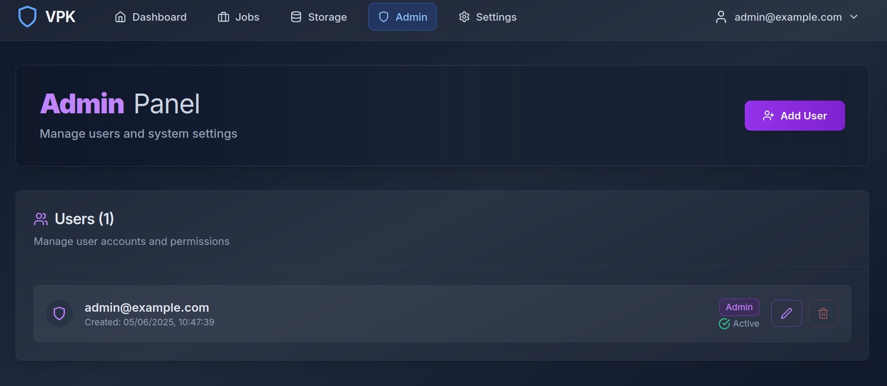

Click "Add User" and create your new admin user.

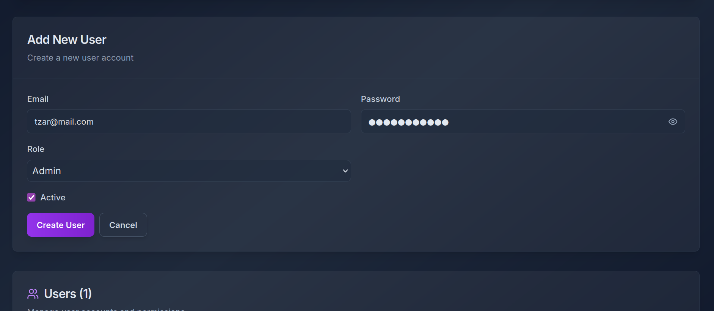

### Disable Default User

Once your new user is created logout of the default admin account and login with your new user. Return to the admin portal and disable the builtin account.

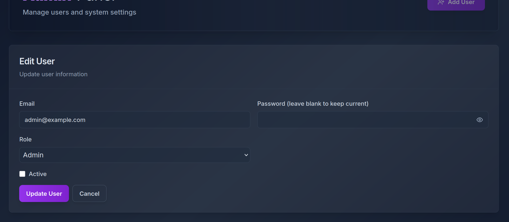

## Updating Catalogue

Once your new user has been created populate the hashlists catalogue. This will ensure any large compressed or common wordlists get all available metadata such as number of passwords, decompressed size etc. These are all used for correct disk space and time estimates.

The Catalog button can be found under Settings.

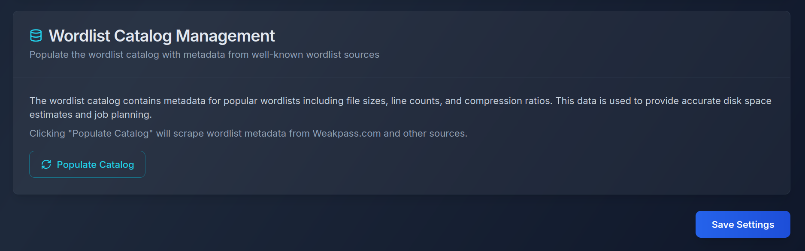

## Updating Settings

Within the settings portal complete all other relevant setting areas. Use the "Test" buttons to confirm API and S3 connectivity.

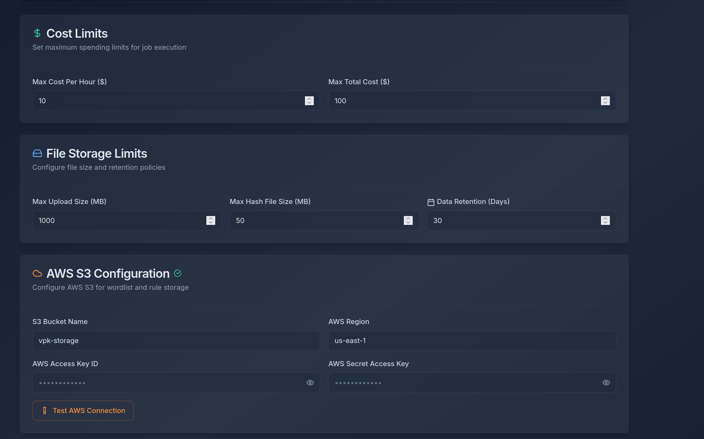

## Uploading wordlists & rules

Its highly recommended that during initial set up you upload a minimal wordlist and rule set via the portal. This will ensure folders are set correctly in your S3 bucket and you can use these to test. Simply navigate to "Storage" and use the Upload functions to place wordlists into the S3 Bucket. Uploads via the portal are capped to 1GB if you want to upload larger compressed wordlists its suggested you use the AWS portal or the CLI to directly add these large wordlists.

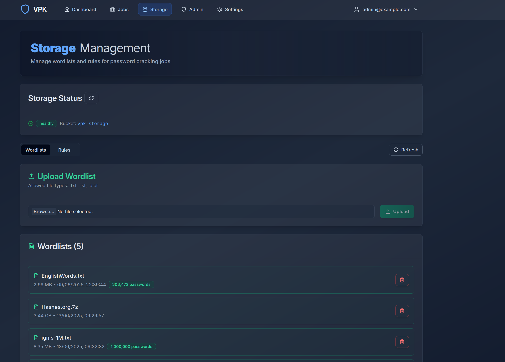

Wordlists uploaded via the portal are automatically parsed for password quantity and other metrics. Larger compressed wordlists are not parsed but are checked against the wordlist catalog when selected for job creation. 

## Creating your first job

With your settings and storage configured you can now proceed to create your first job.

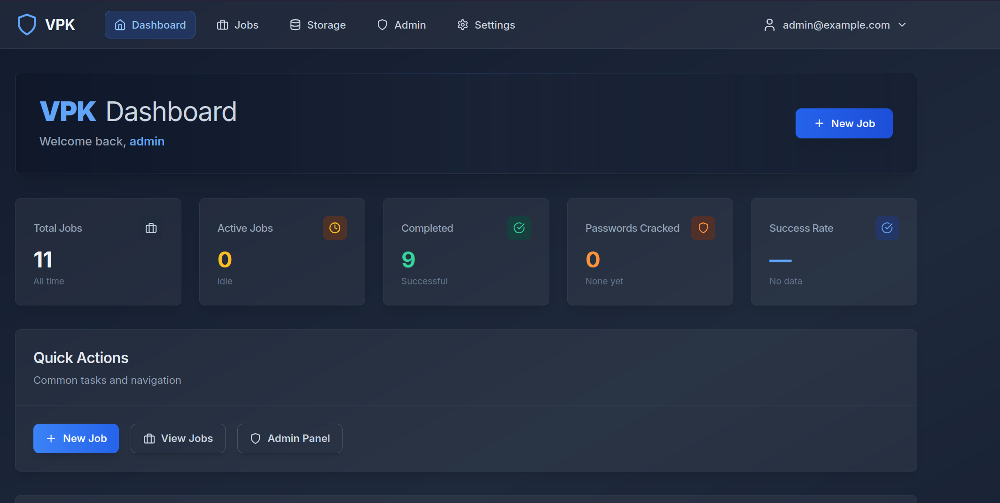

Use the dashboard or the "Jobs" tab to create a new job.

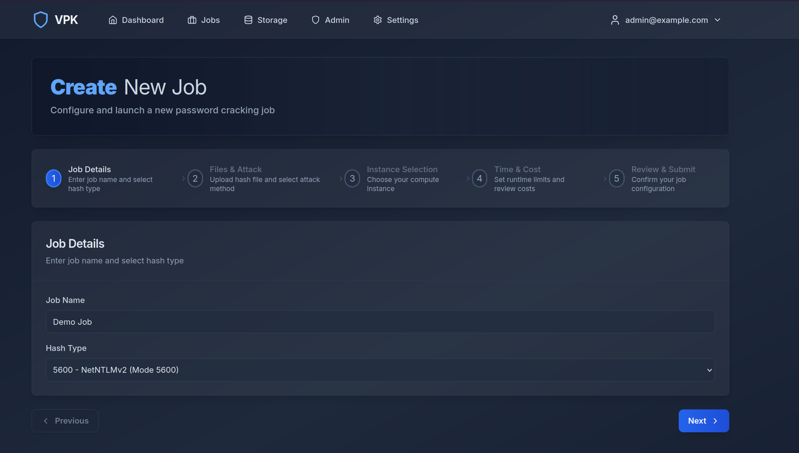

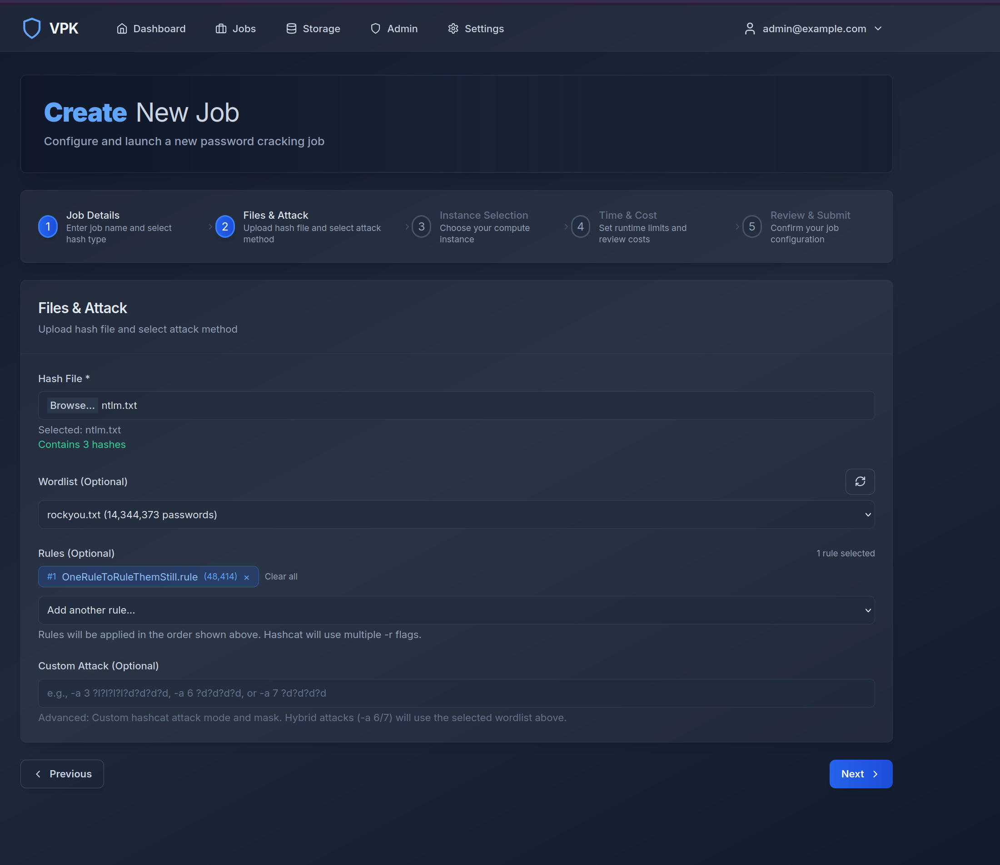

You can assign multiple rules to wordlists. However please note this will increase crack times dramatically the estimates go out the window at this stage. Ensure you account for your own run times. All jobs will shutdown successfully on completion so ensure you have your run times adjusted. The same applies for custom attacks. The portal fully supports both hybrid and mask based attacks. For hybrid approaches ensure you select your relevant wordlists. **Pay careful attention to the spacing and format of the examples for custom attacks**. 

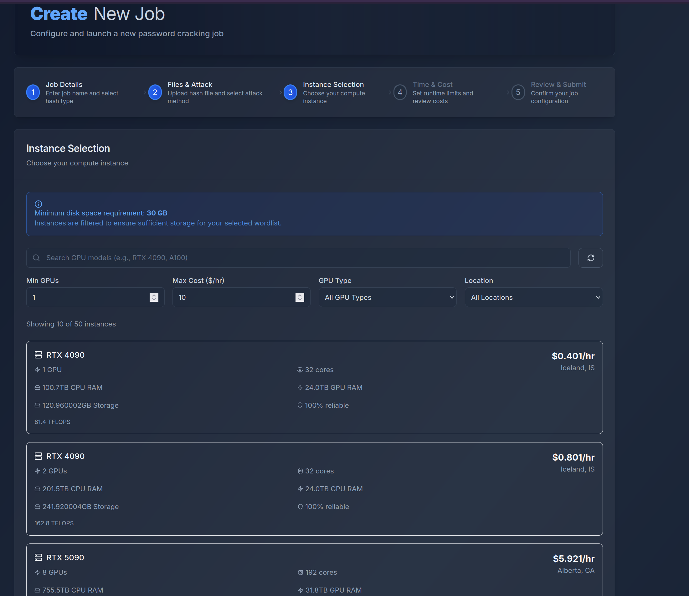

Select your instance type required. The default disk size is 20GB depending on the size of the wordlist being used this will be dynamically assigned. If your internal or personal wordlists are larger than 10 GB, simply modify the source to allocate a large default disk size.

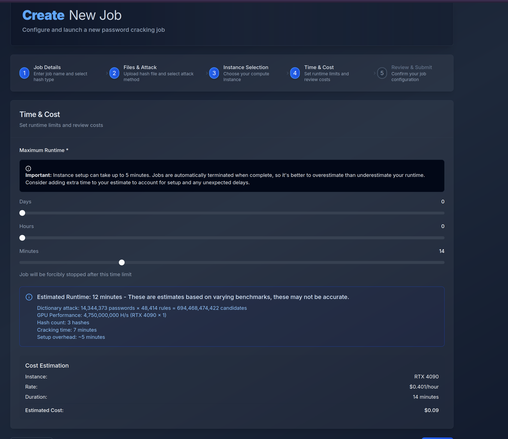

Once the instance is selected you will be presented with basic time & run costs. The estimations are based on some benchmarks but are not always entirely accurate. Its always better to over estimate than under. Setup time for normal smaller wordlists is around 5 minutes. This time may increase significantly if the deployment includes the copying and extraction of very large word lists.

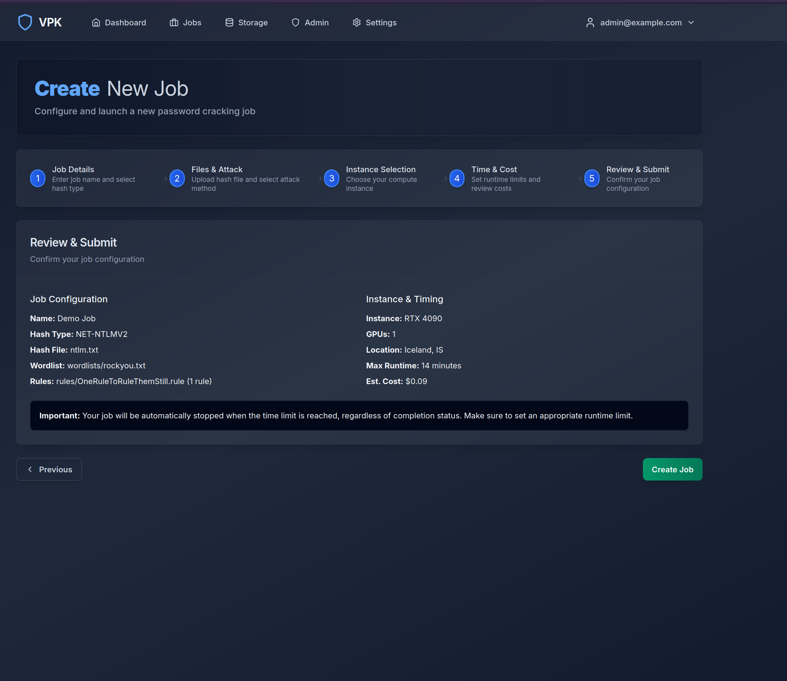

At this stage you are good to go! Simply select create job & Start Job.

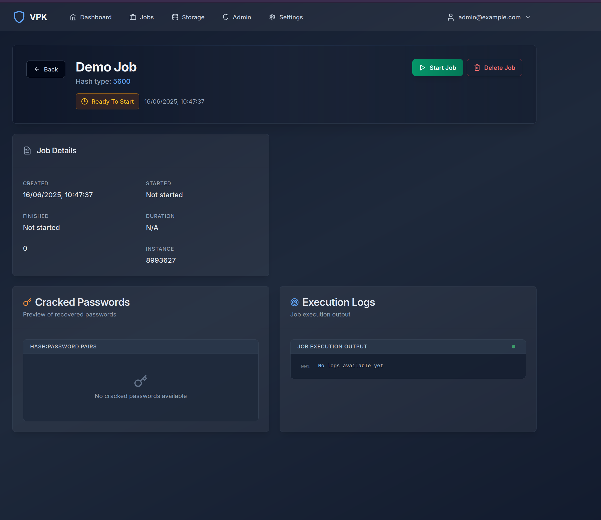

You can then monitor the backend execution of the job via the celery_worker output on the docker group.

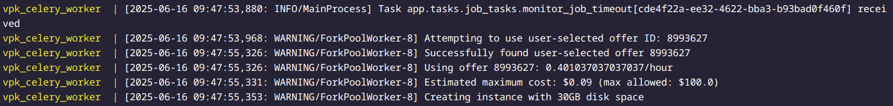

Any errors and progress will be displayed here. The workflow will automatically try to get the instance you requested. If it is no longer available it will fall back to the next best similar price and spec compared to your initial request. 

The crack and deployment statuses and stages will be reflected in the portal. 

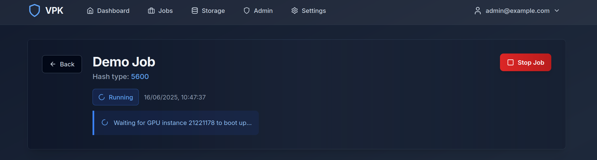

Now you wait for the job to complete. Some instances take significantly more time to boot up and configure than others. If you run into any issues simply stop the job. This will attempt to copy over any existing logs and pot files, then tear down the instances.

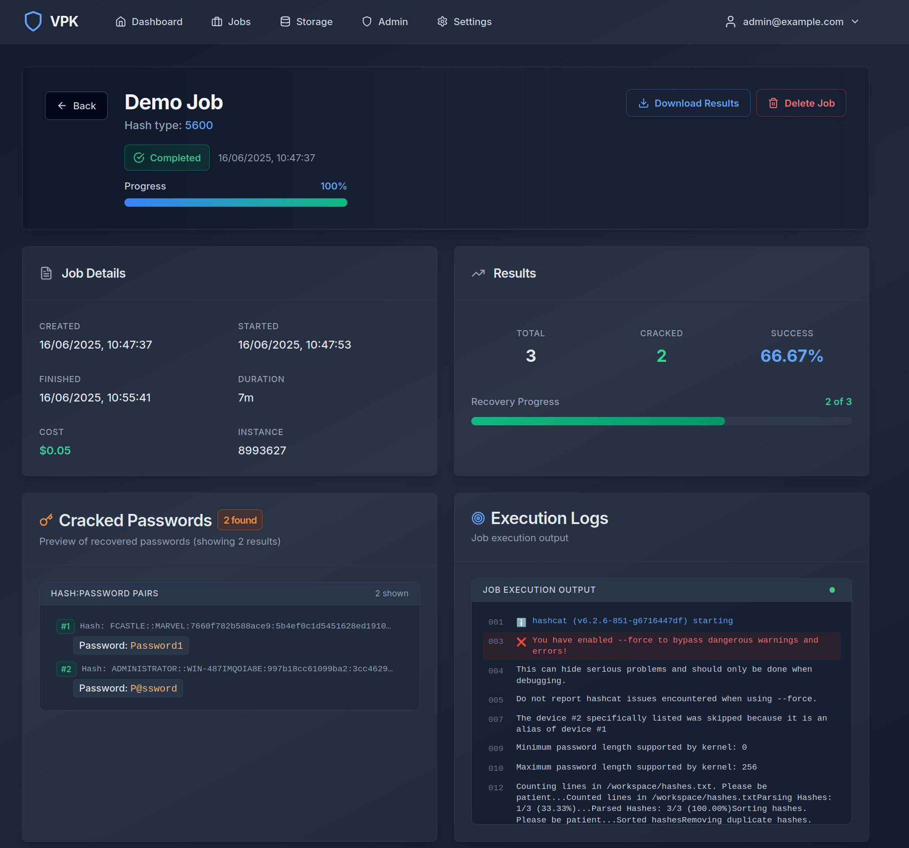